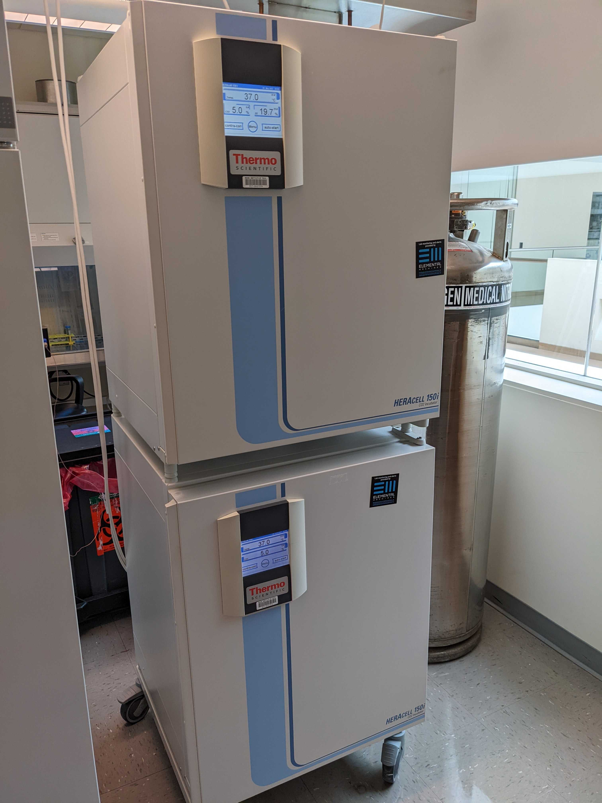
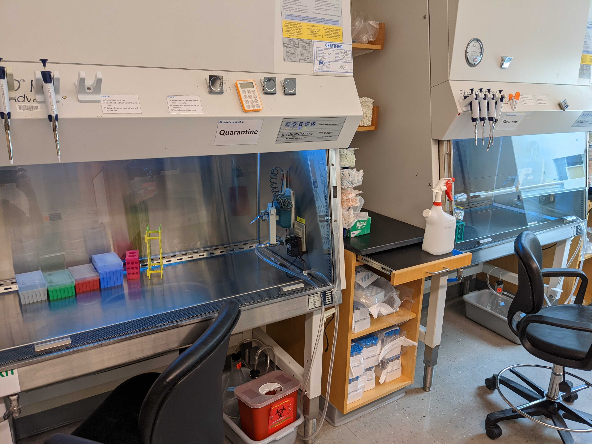
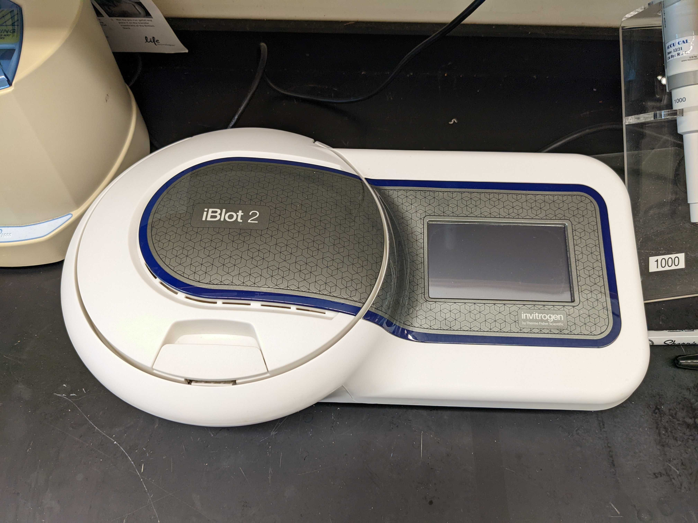
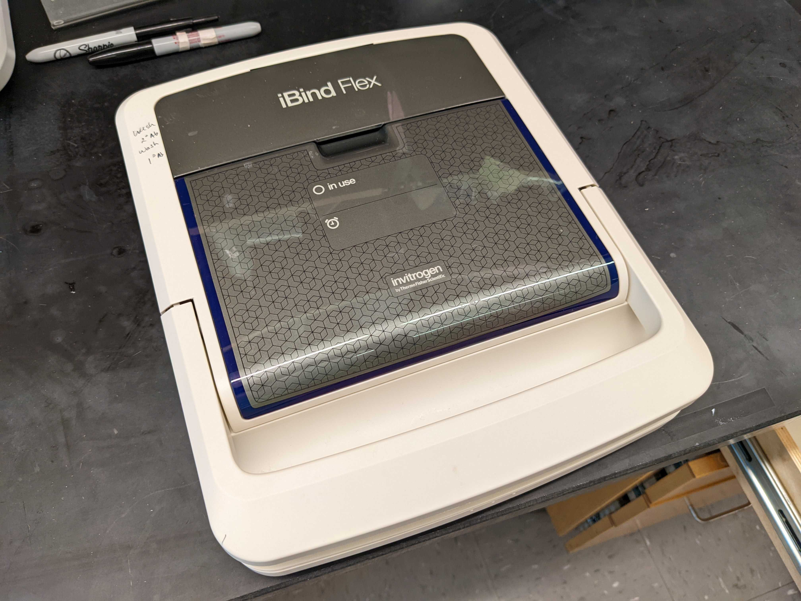
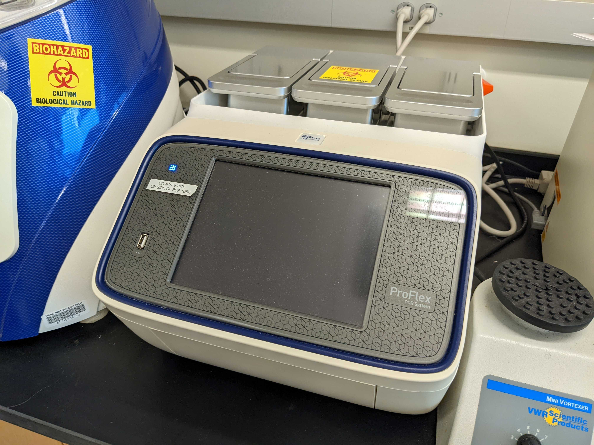
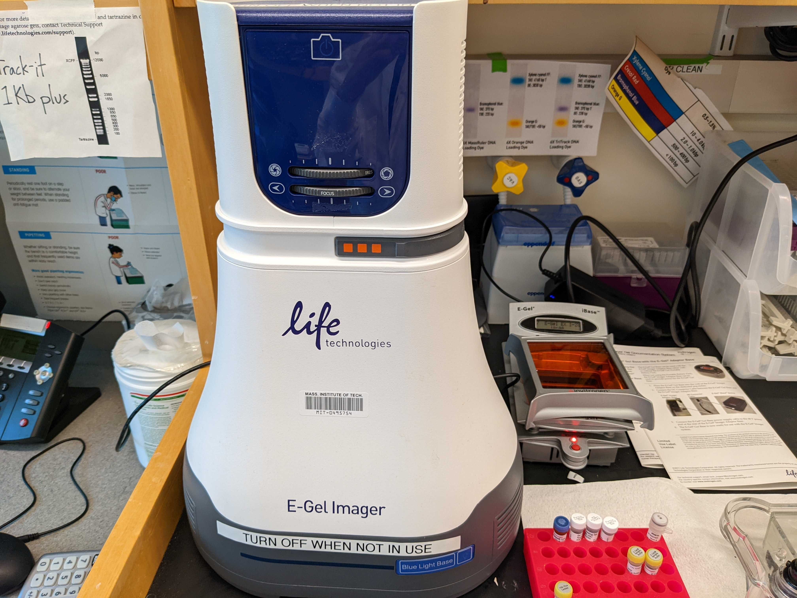
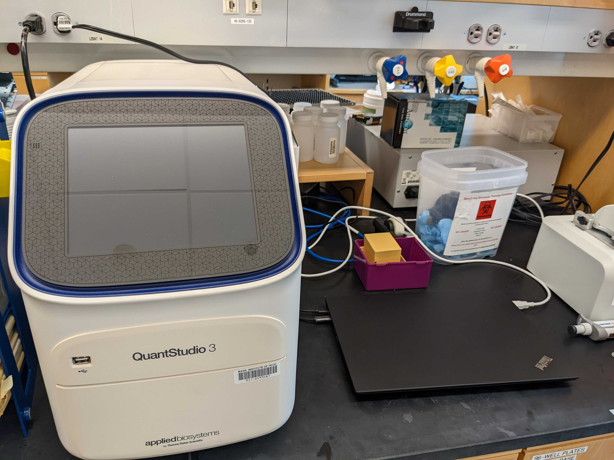

# Sur Lab room and equipment

## Cell culture room (46-6296, PCLM Wet Lab)
```
- Cell culture
- iPS culture
- Organoid culture
- Basic manupulation of molecular biology
- Cell observation
- Flowcytometry
- Cell sorting
```
### Equipment

- 4 × Cell culture incubator

- 4 × Biosafety cabinet

- Inverted fluorescent microscope (Olympus IX81 + Monocrome Camera Q-imaging)
  
- Ordinary observation microscope
- BD FACS melody (iPSC Core)
- Centrifuge
- Electropolator (ECM 830)


## Molucular biology room (46-6066)
```
- Western bolotting
- PCR
- RT-PCR
- DNA extraction
- RNA extraction
- DNA&RNA purification
- DNA&RNA quantification
- SDS PAGE
- NuPAGE Bis-Tris
- Plasmid cloning
```
### Equipment

- Centrifuge (ThormoFisher)
- iBlot 2 (Dry western blotting)

- iBind Flex (Antibody binidng)

- 2×Xcell Sure Lock (Thormo Fisher Scienctific)
- [Mini-gel Tank (Bio-Rad)](https://www.thermofisher.com/order/catalog/product/A25977)
- [Thermal cycler ProFlex](https://www.thermofisher.com/us/en/home/life-science/pcr/thermal-cyclers-realtime-instruments/thermal-cyclers/proflex-pcr-system.html)

- [ FastPrep-24™ Classic bead beating grinder and lysis system](https://www.mpbio.com/us/fastprep-24-classic-instrument-1-each)
- E-gel imager

- E-gel Base
- Real-time PCR system Applied Biosystems (Quant Studio 3)

- Shaker with incubator (For E.coli culture)

## Histlogy room (46-6213)

```
- 3D printing
- Cyosectioning
```
### Equipment

- Form 2 3D printer
-  
## Slice preparation room (46-6215)

```

```

## Two photon room #1 (46-6221)
```bash

```
## Two photon room #2 (46-6222)
```bash

```
## Two photon room #3 (46-6226)
```bash

```
## Confocal microscope room #
```bash

```


